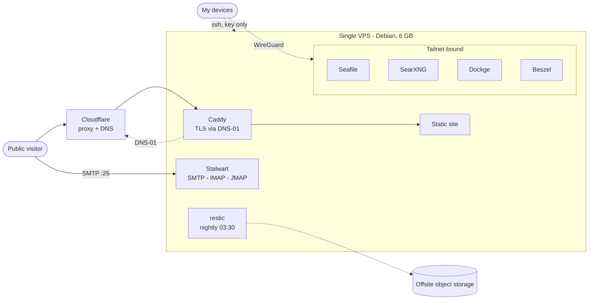
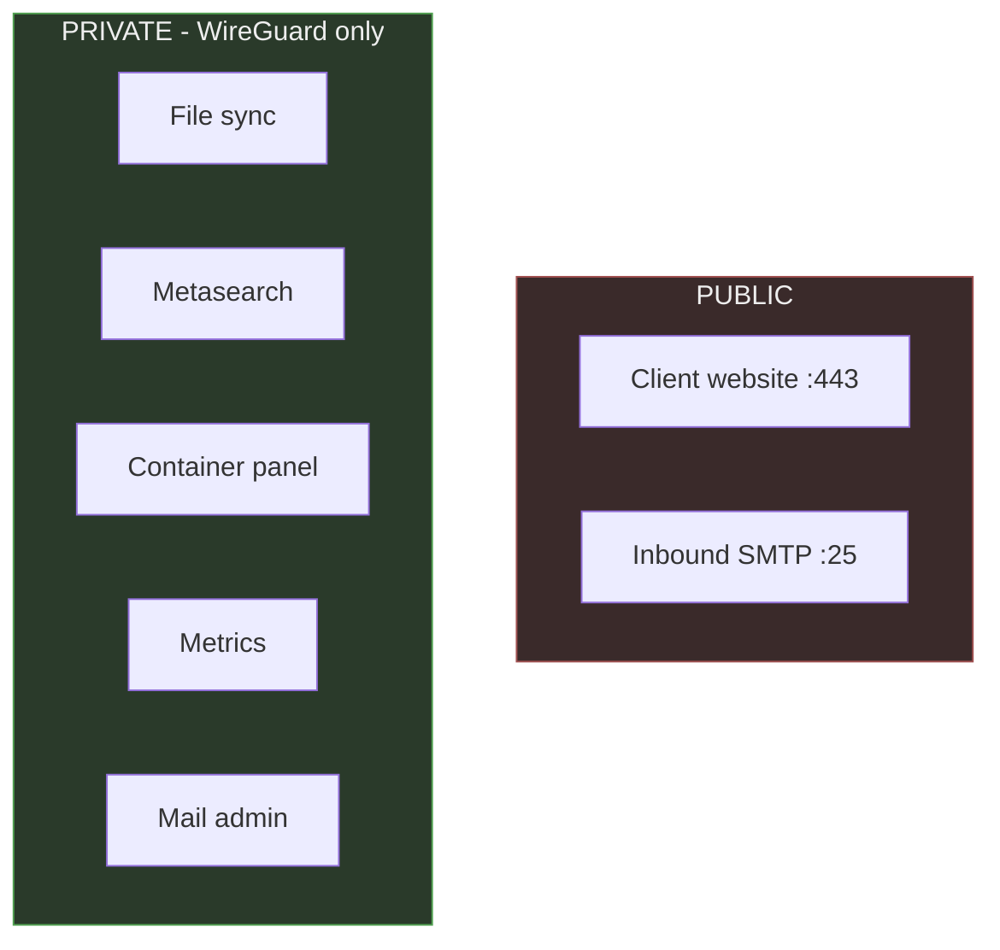
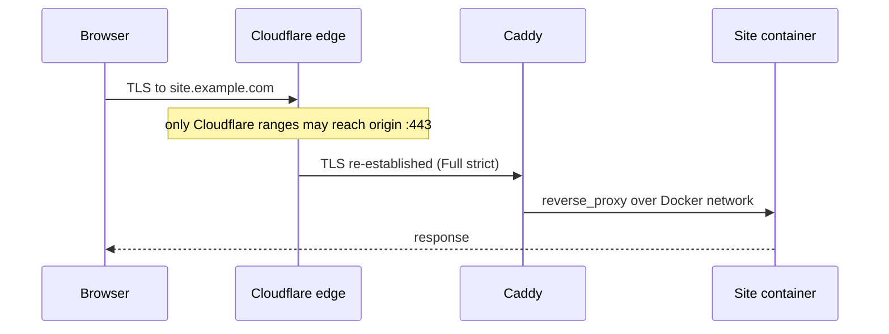

# self-hosted-stack

A client website, mail, file sync, search and monitoring on one 6 GB VPS. This repo is
the architecture and the reasoning. Config and secrets live in a private repo.

Names, addresses and domains are placeholders. The architecture is in production.

## Constraint

One host: 6 GB RAM, 4 vCPU, ~100 GB disk. No second machine, no managed services.
Everything below follows from that.

## Topology

## Exposure

Two ports open: 443 and 25. Everything else binds to the WireGuard address, so there is
no listener on the public interface. Publishing is an explicit act, not a default.

## Decisions

| # | Decision | Reason |
|---|---|---|
| [1](decisions/0001-caddy-over-nginx.md) | Caddy over nginx | DNS-01 out of the box; 15 lines replaced 120 |
| [2](decisions/0002-two-exposure-planes.md) | Tailnet private, Cloudflare public | Not listening beats filtering |
| [3](decisions/0003-compose-over-kubernetes.md) | Compose, not k8s | Control plane alone costs a fifth of RAM, on one node |
| [4](decisions/0004-restic-with-db-dumps.md) | Dump databases before snapshotting | Copying live DB files backs up corruption |
| [5](decisions/0005-sops-age-for-secrets.md) | SOPS + age in git | Config and secrets in one commit, no extra service |
| [6](decisions/0006-self-hosted-mail.md) | Self-hosted mail | Learning decision, not an efficiency one |
| [7](decisions/0007-docker-user-chain.md) | DOCKER-USER, not ufw | Docker walks straight past ufw |

## Operations

Backups nightly 03:30. SQLite `.backup` and `mariadb-dump --single-transaction` write to
a dump dir, then restic snapshots dumps + volumes + config repo. Retention 7d/4w/6m.

Restore is tested by pulling a file from a snapshot and diffing checksums against live.
`restic check` proves the repo is intact, not that the data restores.

One host means no failover. The recovery path is provision, clone, restore, repoint DNS.
Offsite copy is not done yet — until it is, snapshots share a failure domain with the
thing they protect.

## Things that bit me

**Docker publishes past ufw.** `ufw deny 8090` reports success and does nothing — Docker
inserts its rules ahead of the filter chain. Found it when a metrics agent I believed was
firewalled accepted a connection from the open internet. Rules go in `DOCKER-USER`.

**Scope firewall rules by interface.** My first `DOCKER-USER` rule matched dport 443 with
no interface. `DOCKER-USER` sits in `FORWARD`, which carries both directions, so it
matched all container egress and killed it. `-i eth0` fixed it.

**sshd drop-ins: first value wins.** Hardened `99-hardening.conf`, verified it, password
auth still on — `50-cloud-init.conf` sorts earlier and sshd takes the first occurrence.
Renamed to `01-`.

**SSH multiplexing fakes a passing security test.** "Password auth is disabled" kept
passing because `ControlPersist` reused an authenticated connection. Auth tests need
`-o ControlMaster=no -o ControlPath=none`.

**Anonymous volumes lose data on recreate.** Mail data and DKIM keys were on one. Name
every volume that holds state.

**A half-created container keeps its broken state.** A failed `up` leaves a container
that `start` and `restart` reuse — mine had no network attached. `down` then
`up --force-recreate`.

**Verify against the authority, not the cache.** Reverse DNS came back valid from a stale
resolver answer. `dig @1.1.1.1` gave the truth.

Two of these were only visible from off the host. Verify enforcement from outside, never
from a shell on the machine.
