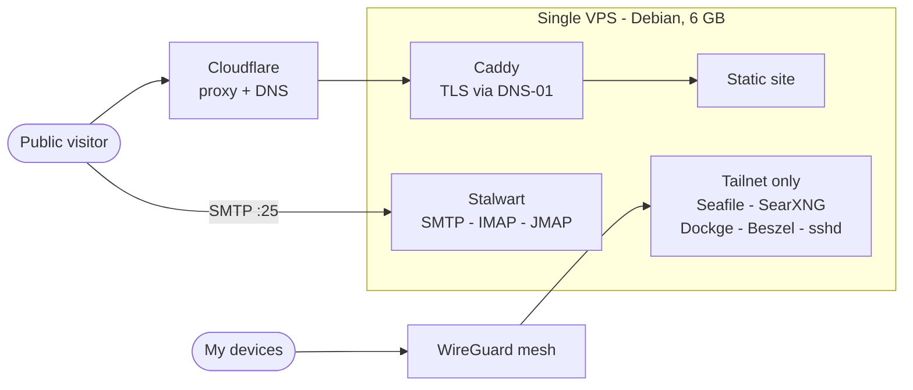
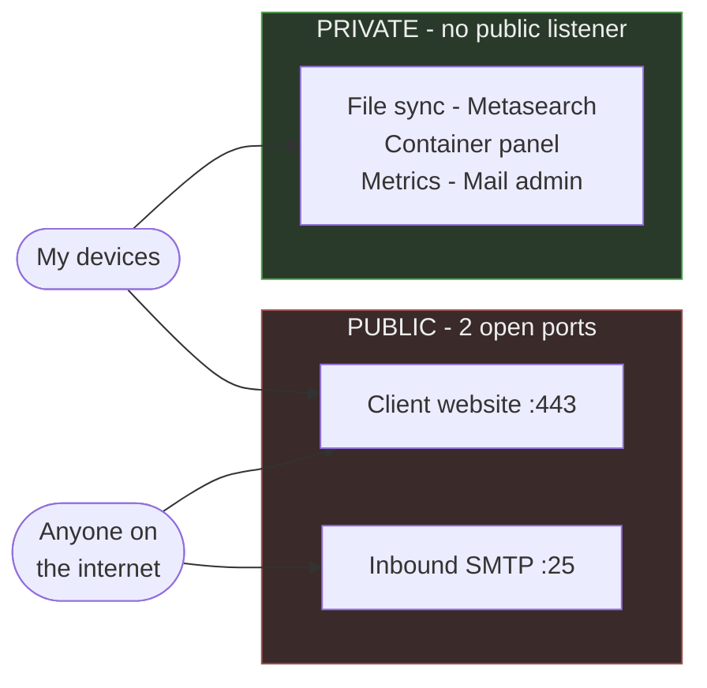
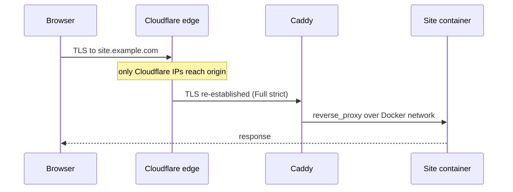
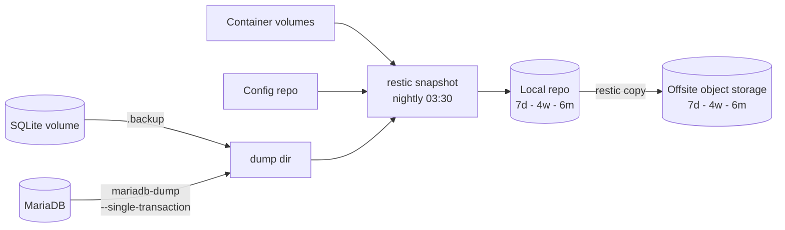

# self-hosted-stack

A client website, mail, file sync, search and monitoring on one 6 GB VPS. This repo is
the architecture and the reasoning. Config and secrets live in a private repo.

Names, addresses and domains are placeholders. The architecture is in production.

## Constraint

One host: 6 GB RAM, 4 vCPU, ~100 GB disk. No second machine, no managed services.
Everything below follows from that.

## Topology

Caddy gets its certificates from Cloudflare over DNS-01, so the ACME challenge never
needs an inbound path to the origin.

## Exposure

Two ports open: 443 and 25. Everything else binds to the WireGuard address, so there is
no listener on the public interface.

## Decisions

| # | Decision | Reason |
|---|---|---|
| [1](decisions/0001-caddy-over-nginx.md) | Caddy over nginx | DNS-01 out of the box; 15 lines replaced 120 |
| [2](decisions/0002-two-exposure-planes.md) | Tailnet private, Cloudflare public | No listener on the public interface |
| [3](decisions/0003-compose-over-kubernetes.md) | Compose, not k8s | Control plane alone costs a fifth of RAM, on one node |
| [4](decisions/0004-restic-with-db-dumps.md) | Dump databases before snapshotting | Copying live DB files backs up corruption |
| [5](decisions/0005-sops-age-for-secrets.md) | SOPS + age in git | Config and secrets in one commit, no extra service |
| [6](decisions/0006-self-hosted-mail.md) | Self-hosted mail | Learning decision, not an efficiency one |
| [7](decisions/0007-docker-user-chain.md) | DOCKER-USER, not ufw | Docker inserts its rules ahead of ufw |
| [8](decisions/0008-mail-server-manages-its-own-dns.md) | Mail server publishes its own DNS | Hand-written records drift from what the server does |
| [9](decisions/0009-offsite-mirror-to-object-storage.md) | Mirror the repo to object storage | Snapshots on the host they protect share its failure domain |

## Operations

Backups nightly 03:30. Databases are dumped first, then restic snapshots the dumps
alongside the volumes and the config repo. Retention 7d/4w/6m.

Restore is tested by pulling a file from a snapshot and diffing checksums against live.
`restic check` proves the repo is intact, not that the data restores.

One host means no failover. The recovery path is provision, clone, restore, repoint DNS.
The offsite mirror runs last in the nightly job, so an object storage outage costs the
remote copy for a night and never the backup itself.

## Failures

**Docker publishes past ufw.** `ufw deny 8090` reports success and does nothing — Docker
inserts its rules ahead of the filter chain. Found it when a metrics agent I believed was
firewalled accepted a connection from the open internet. Rules go in `DOCKER-USER`.

**Scope firewall rules by interface.** My first `DOCKER-USER` rule matched dport 443 with
no interface. `DOCKER-USER` sits in `FORWARD`, which carries both directions, so it
matched all container egress and killed it. `-i eth0` fixed it.

**sshd drop-ins: first value wins.** Hardened `99-hardening.conf`, verified it, password
auth still on — `50-cloud-init.conf` sorts earlier and sshd takes the first occurrence.
Renamed to `01-`.

**SSH multiplexing fakes a passing security test.** "Password auth is disabled" kept
passing because `ControlPersist` reused an authenticated connection. Auth tests need
`-o ControlMaster=no -o ControlPath=none`.

**Anonymous volumes lose data on recreate.** Mail data and DKIM keys were on one. Name
every volume that holds state.

**A half-created container keeps its broken state.** A failed `up` leaves a container
that `start` and `restart` reuse — mine had no network attached. `down` then
`up --force-recreate`.

**Verify against the authority, not the cache.** Reverse DNS came back valid from a stale
resolver answer. `dig @1.1.1.1` gave the truth.

**Docker's userland proxy hides the client IP.** `docker-proxy` accepts the connection and
opens a *second* one to the container, so the service sees the bridge gateway
(`172.18.0.1`) for every client. Found it when a credential restricted to the VPN range
rejected a connection from inside that range. Worse for mail: SPF validates the connecting
IP, so once mail flows every sender looks identical. Fix is `"userland-proxy": false`,
host networking, or PROXY protocol.

**An IP allowlist on a dual-stack host must list both addresses.** I locked an API token
to the server's IPv4. Every call failed — the host has IPv6 and Linux prefers it for
egress, so the provider saw an address that wasn't on the list. Fails cleanly with one
client, but shows up as "works sometimes" anywhere busier.

**Changing a setting is not the same as triggering the action.** Editing which DNS records
the mail server should publish changed the stored config and scheduled nothing. Toggling
the management mode off and on queued the job and all seven records appeared in seconds.
Check that work was *scheduled*, not just that the write returned success.

**`docker compose run` on a stateful service steals the database lock.** I used it to test
a recovery path; it started a second instance from the same image, which took the RocksDB
lock, and the real container crash-looped until I removed the stray one. Use a throwaway
volume, or stop the service first.

**"All my visitors are in the United States" was three things, and the obvious one was
wrong.** Self-hosted analytics behind a CDN showed 100% US traffic for a Brazilian site.
First theory: the CDN's anycast IPs geolocate to the provider's registered address, so
the analytics was reading the edge IP instead of the visitor. That theory is true about
anycast and false here. What killed it was a field that was *empty*: if a geo database
had resolved the edge IP, it would have filled in a city. Country present, city missing
meant the country came from the CDN's `cf-ipcountry` header, which is computed from the
real client. A single tagged test event sent from Brazil came back `BR`, then got
deleted. The country was never wrong. City and region were blank because location
headers beyond country are off by default and need a managed transform. And the US
traffic was real US traffic: scanners. `screen=800x600` and `language=en-US@posix` — a
POSIX locale string no browser emits — with a spoofed Chrome user-agent that walked
straight past the user-agent bot check. Three lessons, in order of value: the empty
field was more diagnostic than the wrong one; one cheap labelled test beat an afternoon
of theory; and analytics with no bot filter measures the internet, not your audience.

Three of these were only visible from off the host. Verify enforcement from outside, never
from a shell on the machine.
