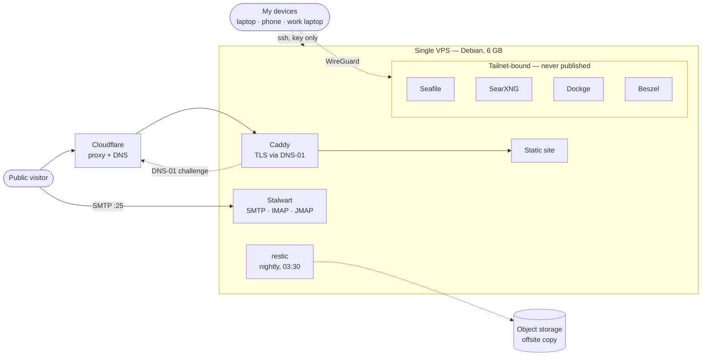
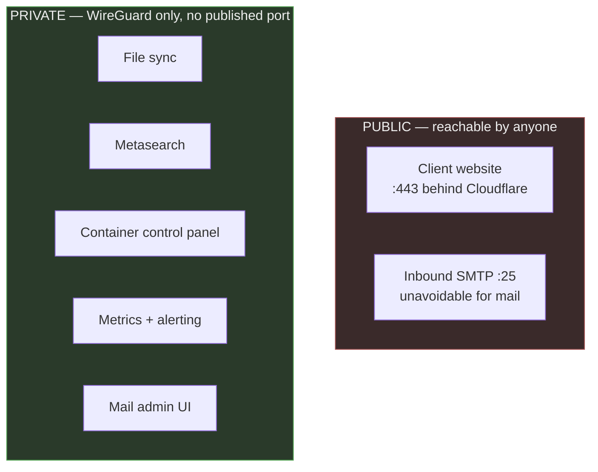

# self-hosted-stack

How I run everything I depend on — websites, mail, file sync, search, monitoring — on
**one 6 GB VPS**, and why each piece is the piece it is.

This is not a "look at my homelab" repo. It is the reasoning: the trade-off behind every
component, the failures that changed my mind, and the operational habits that keep it
boring. Diagrams are Mermaid so they render here and stay in version control with the
thing they describe.

Names, addresses and domains are placeholders. The architecture is real and in production.

---

## The constraint

One host. 6 GB RAM, 4 vCPU, ~100 GB disk. No Kubernetes, no managed anything, no second
machine to fail over to. Every design decision below is downstream of that, and of one
rule I hold myself to: **understand the layer beneath the abstraction before leaning on
it.** Managed services are fine, but not as a way to avoid knowing how the thing works.

---

## Current topology



Solid = default path. Dotted = control/secondary path.

## Two exposure planes

The single most useful idea in this stack: **every service is either public or it is on
the tailnet, and nothing is accidentally both.** Publishing is an explicit act.



Two ports are open to the internet: 443 and 25. Everything else binds to the tailnet
address, so there is no port to scan and no login page to brute-force. The firewall is a
second line, not the first — the first is simply not listening.

## Request path, public site

```mermaid
sequenceDiagram
    participant B as Browser
    participant CF as Cloudflare edge
    participant C as Caddy
    participant S as Site container
    B->>CF: TLS to site.example.com
    Note over CF: origin IP never exposed;<br/>only Cloudflare ranges may reach :443
    CF->>C: TLS re-established to origin (Full strict)
    C->>S: reverse_proxy over Docker network
    S-->>B: response
```

---

## Decisions

Each links to the full write-up: context, what I picked, what I rejected, and what it
costs me.

| # | Decision | One-line reason |
|---|---|---|
| [1](decisions/0001-caddy-over-nginx.md) | Caddy over nginx | Automatic TLS including DNS-01; ~15 lines replaced ~120 |
| [2](decisions/0002-two-exposure-planes.md) | Tailnet for private, Cloudflare for public | Not listening beats filtering |
| [3](decisions/0003-compose-over-kubernetes.md) | Docker Compose + Dockge, not k8s | k8s control plane alone would eat a quarter of the RAM |
| [4](decisions/0004-restic-with-db-dumps.md) | restic, with database dumps before the snapshot | Copying live DB files gives you a corrupt backup that restores fine |
| [5](decisions/0005-sops-age-for-secrets.md) | SOPS + age, secrets encrypted in git | Config and its secrets stay in one repo, no extra service to run |
| [6](decisions/0006-self-hosted-mail.md) | Self-hosted mail, entered deliberately | The one decision I would tell most people not to copy |
| [7](decisions/0007-docker-user-chain.md) | Firewall in DOCKER-USER, not ufw | Docker writes its own iptables rules and walks straight past ufw |

---

## Operations

**Backups.** Nightly at 03:30. SQLite via `.backup` and MariaDB via `mariadb-dump
--single-transaction` are written to a dump directory *first*, then restic snapshots the
dumps plus the container volumes plus the config repo. Retention 7 daily / 4 weekly /
6 monthly, pruned in the same run.

A backup is a claim until you restore it. The restore is tested by pulling a file out of
a snapshot and comparing checksums against the live copy — end to end, not just
`restic check`.

**Monitoring.** Agent-based metrics with history and alerting, bound to the tailnet
address. The agent listens on a port, and a metrics agent reachable from the internet is
a liability, not a feature — see decision 7 for how I found that out.

**Failure model.** One host means no failover; I am honest about that rather than
pretending otherwise. What I do have is a tested restore path and infrastructure in git,
so the recovery story is "provision, clone, restore, repoint DNS" instead of "remember
what I did last year." The next real improvement is a second host, not more services on
this one.

---

## Things that bit me

The part worth reading. Every one of these was found in production, on my own time, and
changed how the stack is built.

**Docker publishes past your firewall.** `ufw deny 8090` looks like it worked and does
nothing. Docker inserts its own rules ahead of the filter chain, so a published port is
reachable no matter what ufw says. I confirmed this the ugly way: a metrics agent I
believed was firewalled off accepted a connection from the open internet. Rules must go
in the `DOCKER-USER` chain, and the fix must be verified from off-host — never from
inside it.

**Scope firewall rules by interface.** My first `DOCKER-USER` rule matched destination
port 443 without specifying an interface, which also matched every *outbound* packet from
every container. All egress broke instantly. Adding `-i eth0` fixed it. A rule that says
what it means still has to say which direction it means.

**sshd drop-ins: first value wins, not last.** I hardened `99-hardening.conf`, verified
it, and password auth was still enabled — because `50-cloud-init.conf` sorts earlier and
sshd takes the *first* occurrence of a keyword. Renaming to `01-` fixed it. The opposite
of how nearly every other config system behaves.

**SSH multiplexing will lie to you in security tests.** My "password auth is disabled"
check kept passing because `ControlPersist` was quietly reusing an already-authenticated
connection. Any test of an auth change needs `-o ControlMaster=no -o ControlPath=none`,
or it is testing nothing.

**Anonymous volumes lose data on recreate.** A container declared with a bare mount path
gets a fresh anonymous volume every time it is recreated, and the old one is orphaned.
Mail data and DKIM keys sat in one of these. Name every volume that holds state.

**A half-created container keeps its broken state.** A compose `up` that fails partway
leaves a container that `start` and `restart` happily reuse — mine had no network
attached at all, and no amount of restarting fixed it. `down` then `up --force-recreate`
is the only thing that rebuilds it properly.

**Verify against the authority, not the cache.** I checked reverse DNS with the system
resolver and got a confident, stale, wrong answer. Query the authoritative server
directly (`dig @1.1.1.1`) when the answer is the thing you are trying to prove.

---

## Repo layout

```
README.md          you are here — topology, decisions index, lessons
decisions/         one file per decision: context, choice, rejected, cost
```

Configuration and secrets live in a separate private repository. This one is the
reasoning, which is the part that transfers.
